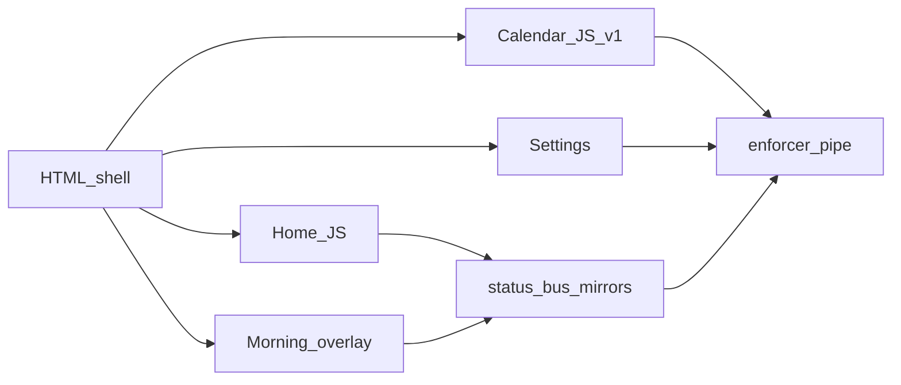

# CALT Focus hybrid HTML shell (2026-10-03)

**Status:** Design — await owner approval before implementation  
**Host (locked):** `calt_focus.exe` + WebView2 → `https://calt.app` / `dist-focus/`  
**Not in scope:** Electron, Qt, Study `:8000` as SoftLand brain

## Intent

Make Focus **feel instant** on cold start and Home/morning, while keeping the same visual language (gloss tokens, sidebar rail, morning green overlay). Rebuild tab UIs in **plain HTML + CSS + small JS modules** talking to the existing enforcer bridge — not a second product stack.

Owner lock (2026-10-03): **all Focus calendar features** move to HTML/CSS/vanilla JS — day/week/month, DnD move/resize, planned+actual layers, hour slices, drafts, planning-only Plan tab. No permanent React calendar island.

That is **possible** (same Chromium WebView). It is **not** “basic HTML” — it is a custom calendar (~feature parity with current `PlannerCalendar` + DnD). Ship in slices so Home stays usable while the calendar is rebuilt.

## Architecture

```text
calt_focus WebView2
  └─ dist-focus/                 (or calt-focus/frontend/shell/)
       index.html                ← chrome + hash routes
       css/tokens.css            ← shared look (port from glossy / Tailwind vars)
       css/shell.css
       js/bridge.js              ← chrome.webview.postMessage → enforcer_cmd
       js/mirrors.js             ← /calt-data/*.json reads
       js/status-bus.js          ← 5s mirrors; rare pipe
       js/router.js              ← #/home #/calendar #/settings #/bible #/journal
       js/pages/home.js
       js/pages/morning.js       ← fullscreen overlay
       js/pages/calendar.js      ← day/week grid (vanilla)
       js/pages/settings.js      ← phased; Settings may stay React island longer
       optional: react-island.js ← load React chunk ONLY for Settings until ported
```



### Rules

1. **One bridge queue** — same serialization rule as today’s `enforcerNativeCmd`; no parallel hammering.
2. **Mirrors first** — Home/morning never need pipe on every paint.
3. **No Study `:8000`** in Focus shell paths.
4. **SoftLand ≠ Arm** naming unchanged.
5. React is **not deleted overnight** — Study app keeps React; Focus sheds it tab by tab.

## Visual parity

- Extract CSS variables from current Focus theme (`gloss-panel`, rail, amber morning, sidebar sticker optional later).
- Screenshot Home + morning + day calendar before/after; match spacing and type, not pixel-perfect DnD chrome.
- Sidebar calligraphy sticker: **Phase 2+** (SVG filters are GPU-heavy); ship plain title first.

## Phases (ship each; stop when smoke passes)

### Phase 0 — Shell + Home + morning (cold-start win)

**Deliver**

- Static `index.html` + router + sidebar (Home / Calendar / Plan stub / Settings / Bible)
- Morning fullscreen overlay (same copy/CTAs as `MorningBibleOverlay`)
- Home: day-loop snapshot via mirror + `day.loop_snapshot` once; Confirm plan button; GlanceBar numbers from `day_rollup`
- Bible: thin page that opens corpus via existing `/calt-bible/` + `bible.devotion.done` gateway

**Success:** Focus opens to Home without loading 1.6MB React; morning lock works; Confirm still SoftLand+Arm.

**Keep temporarily:** React `dist-focus` behind a flag OR dual-entry until Phase 0 smoke green, then cut over default.

### Phase 1 — Vanilla calendar (full feature parity, sliced)

Goal: replace React `PlannerCalendar` entirely. Same UX, HTML/CSS/JS only.

| Slice | Features |
|-------|----------|
| **1a** | Day + Week hour grid; `plan.list` / upsert / delete; click-to-add; edit title/duration/status |
| **1b** | Planned vs actual toggles; `plan.overlay` sessions + hour-slice bars |
| **1c** | Pointer DnD: move + resize blocks (no react-big-calendar / react-dnd) |
| **1d** | Month view + nav; display prefs (hour stretch) in `localStorage` |
| **1e** | Plan-tab mode: draft blocks, planning-only, propose merge hooks (same gateway ops) |

**Success:** No React calendar import in Focus; tab switch keeps grid mounted; all current calendar behaviors covered; pipe timeouts stay short.

**Effort reality:** 1a–1b days; 1c–1e is the bulk (DnD + month + Plan tab). Still faster cold-start than shipping React calendar if shell (Phase 0) lands first.

### Phase 2 — Settings HTML (or thin React island)

- Overview / Blocks / Unlock / Arm lists via mirrors + gateway patches
- Hide demo clock (already Focus policy)
- Contour sticker panel last (or drop)

### Phase 3 — Retire Focus React entry

- `FocusApp.tsx` / Vite React focus build become legacy or Study-only
- `npm run build:focus` builds the HTML shell into `dist-focus/`
- Docs: update `calt-focus/frontend/README.md` + `AGENTS.md` Focus FE line

## What we are *not* claiming

- “Basic HTML will feel like native Win32.” WebView2 is still Chromium.
- “Full calendar parity in a weekend.” Parity is the **goal**; slices 1a→1e are how we get there without freezing Home.
- Removing C++ / SoftLand / Arm — host and engines stay.

## Risk controls

| Risk | Mitigation |
|------|------------|
| Design drift | Shared `tokens.css`; visual QA screenshots per phase |
| Pipe lag returns | status-bus + short timeouts; no interval+pipe loops |
| Calendar feature loss | Phase 1b backlog; Plan tab can stay React island until 1b |
| Dual maintenance | Cut over one default entry ASAP after Phase 0 |

## Approval gate

Owner approves this phased hybrid (Home/morning HTML first, then **full** vanilla calendar 1a→1e, Settings later) before any scaffold under `calt-focus/frontend/shell/`.
